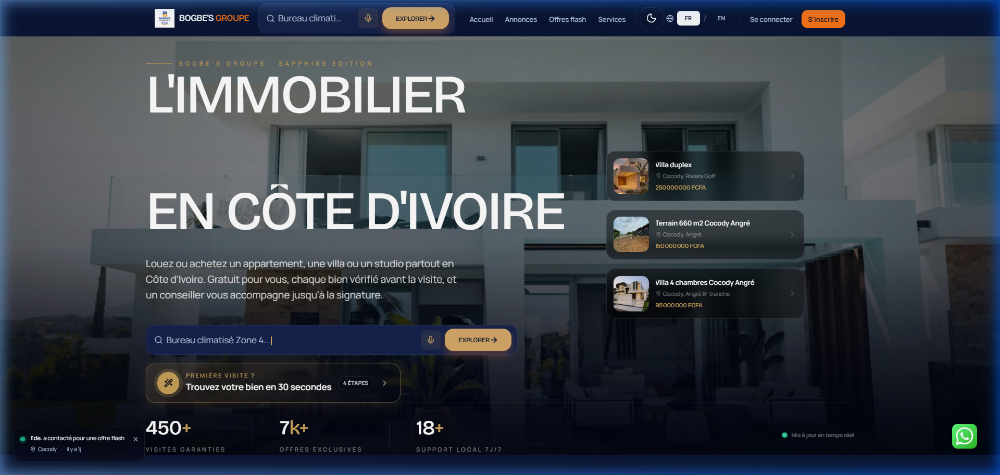
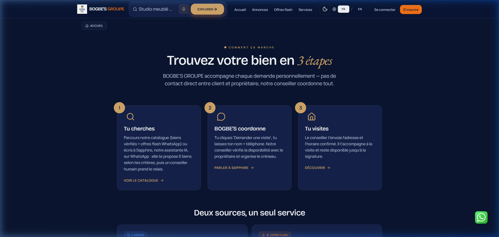
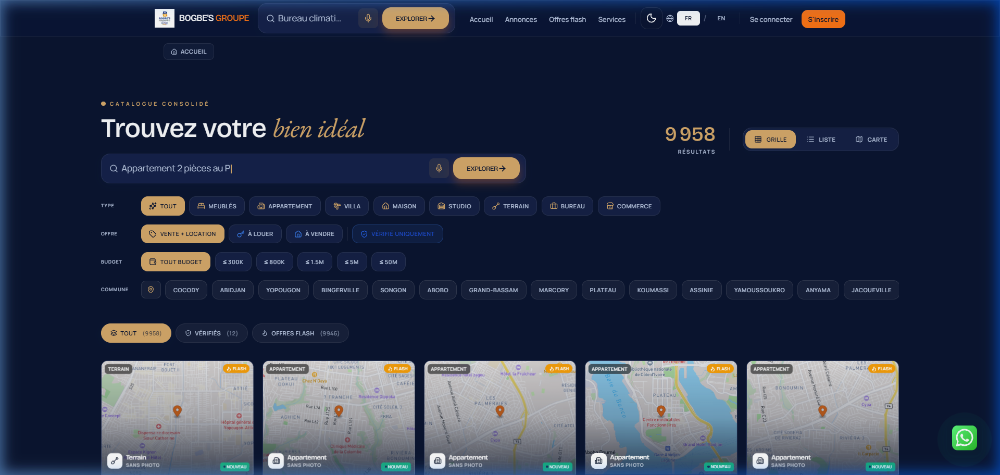
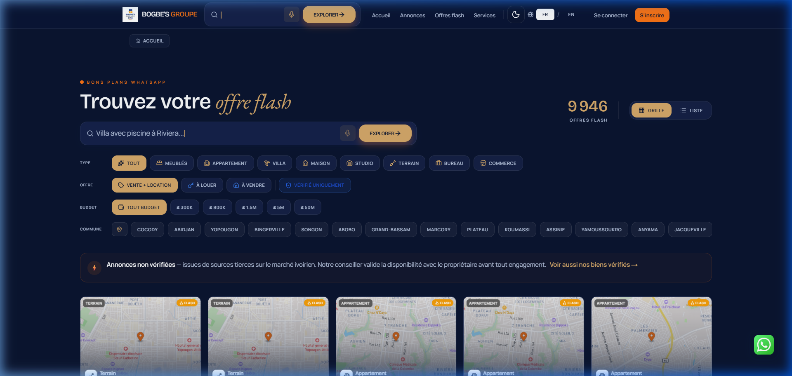

# 🗺️ Storyboard - Immo CI (BOGBE'S GROUPE)

Ce storyboard décrit le parcours utilisateur clé au sein de la plateforme immobilière haut de gamme **BOGBE'S GROUPE (Sapphire Edition)**. L'application utilise une charte visuelle moderne "Dark Mode" de couleur bleu nuit profond, rehaussée de touches or/orange chaleureux pour guider les interactions.

---

## 📸 Aperçu du Parcours Utilisateur

---

## 🗺️ Description Détaillée des Étapes du Storyboard

### 🏠 Étape 1 : La Page d'Accueil (Landing Page)
Le point d'entrée principal de l'utilisateur, conçu pour inspirer confiance et prestige.

* **Visuel clé** : `screenshots/homepage.png`
* **Éléments d'interface marquants** :
  * **Hero Section** : Un grand titre blanc épuré (*"L'IMMOBILIER EN CÔTE D'IVOIRE"*) sur fond de villa moderne avec un filtre sombre élégant.
  * **Barre de Recherche Intuitive** : Un champ de recherche central permettant de taper directement une requête (ex: *"Bureau climatisé Zone 4..."*) avec un bouton d'action *"EXPLORER"* de couleur or.
  * **Cartes de Propriétés Vedettes** : Une liste verticale flottante sur la droite présentant des biens prestigieux avec leur prix en FCFA (ex: *Villa duplex à Cocody Riviera Golf à 250M FCFA*).
  * **Preuve Sociale & Statistiques** : Trois compteurs clés en bas de page pour rassurer le client (*450+ visites garanties, 7k+ offres exclusives, 18+ support local 7J/7*).
  * **Notification d'Activité en Direct** : Une infobulle discrète en bas à gauche signalant l'activité récente d'autres utilisateurs (ex: *"Ede a contacté pour une offre flash"*).
  * **Bouton WhatsApp Flottant** : Toujours disponible en bas à droite pour engager une conversation instantanée avec l'IA Sapphire.

---

### ❓ Étape 2 : Le Fonctionnement (Comment ça marche)
Cette page éducative explique de manière transparente comment la plateforme élimine les frictions habituelles du marché immobilier ivoirien.

* **Visuel clé** : `screenshots/comment_ca_marche.png`
* **Parcours en 3 Étapes Clés** :
  1. **Tu cherches** : L'utilisateur explore le catalogue de biens vérifiés ou interagit directement avec l'IA Sapphire sur WhatsApp qui lui propose des sélections adaptées.
  2. **BOGBE'S coordonne** : Dès que l'utilisateur clique sur *"Demander une visite"*, un conseiller dédié gère toute la logistique avec le propriétaire pour bloquer un créneau.
  3. **Tu visites** : Le conseiller accompagne physiquement l'utilisateur lors de la visite du bien et reste à ses côtés jusqu'à la signature finale.
* **Boutons d'Appel à l'Action** : *"VOIR LE CATALOGUE"*, *"PARLER À SAPPHIRE"* et *"DÉCOUVRIR"* pour inciter à la conversion.

---

### 🔍 Étape 3 : Le Catalogue Consolidé
L'espace d'exploration où l'utilisateur filtre et trouve son futur bien.

* **Visuel clé** : `screenshots/catalogue.png`
* **Caractéristiques Techniques & Filtres** :
  * **Compteur Dynamique** : Affiche le volume de résultats disponibles (*9 958 résultats*).
  * **Affichage Flexible** : Possibilité de basculer la vue en mode **Grille**, **Liste** ou **Carte**.
  * **Système de Filtrage Avancé (Pills)** :
    * **Type de Bien** : Meublés, Appartement, Villa, Maison, Studio, Terrain, Bureau, Commerce.
    * **Type d'Offre** : À louer, À vendre, ou Vérifié uniquement.
    * **Budget** : Raccourcis rapides par tranches de budget (<= 300K, <= 800K, etc.).
    * **Localisation (Communes)** : Filtres par quartiers d'Abidjan et villes environnantes (Cocody, Yopougon, Bingerville, Marcory, Assinie, etc.).
  * **Grille de Résultats** : Présentation sous forme de cartes affichant la géolocalisation précise sur carte (ou fallback d'attente) avec des badges distinctifs *"FLASH"* ou *"NOUVEAU"*.

---

### ⚡ Étape 4 : Les Offres Flash (Bons Plans WhatsApp)
Une section dédiée aux annonces non vérifiées issues de sources tierces, permettant de capter toutes les opportunités du marché avant tout le monde.

* **Visuel clé** : `screenshots/offre_flash.png`
* **Éléments Spécifiques** :
  * **Bandeau de Prévention GDPR & Transparence** : Un avertissement important rappelant à l'utilisateur que ce sont des annonces tierces non encore certifiées, et qu'un conseiller vérifiera systématiquement la disponibilité et la légitimité avant toute visite.
  * **Mise en Page Similaire au Catalogue** : L'utilisateur conserve ses habitudes de navigation avec le même système de filtres (Commune, Budget, Type) appliqué à cette base de données élargie.

---

## 💎 Analyse de l'Expérience Utilisateur (UX/UI)

1. **Esthétique Premium** : Le contraste élevé entre le fond sombre (deep navy) et les accents or/orange confère une dimension haut de gamme et professionnelle.
2. **Clarté du Service** : Le fait de déléguer la négociation et la coordination à BOGBE'S GROUPE rassure immédiatement l'utilisateur face aux arnaques immobilières fréquentes.
3. **Omniprésence du Canal WhatsApp** : L'intégration forte de WhatsApp (bouton de contact direct, offres flash issues du scraping de groupes) s'adapte parfaitement aux habitudes de communication en Côte d'Ivoire.
